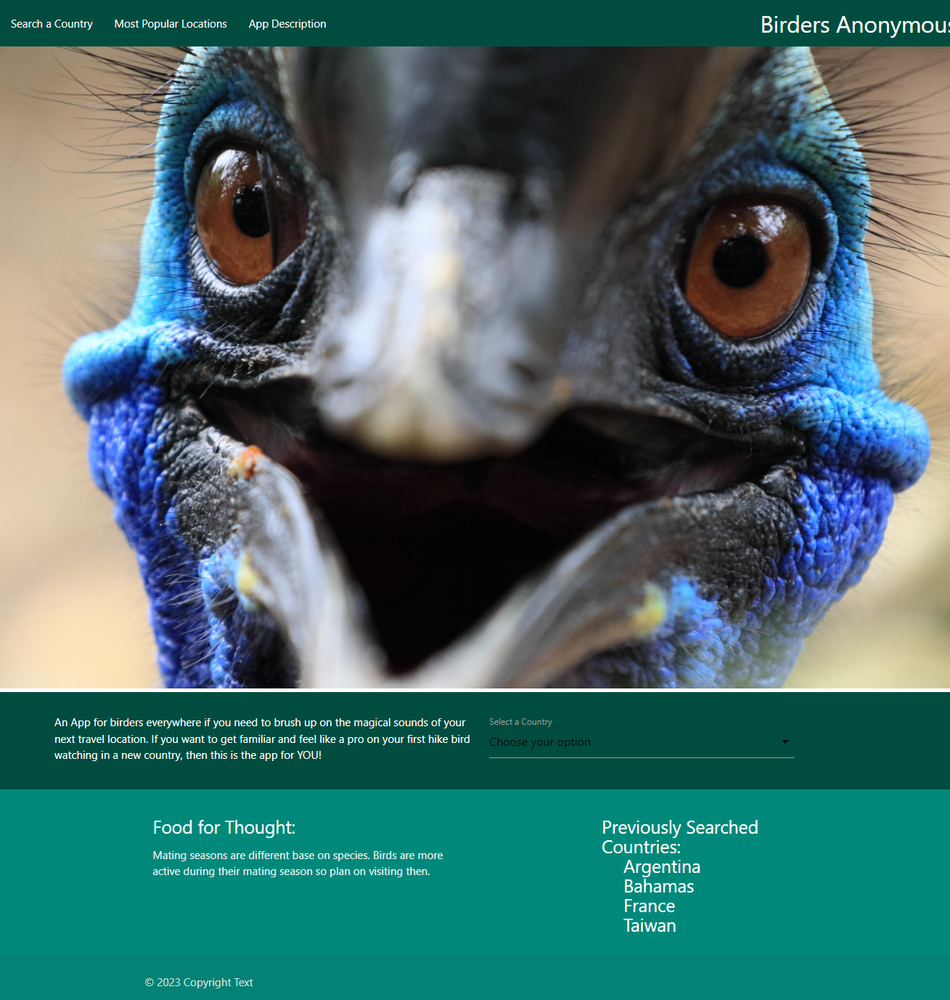

# Birders Anonymous 🐤

## Description

An App for birders everywhere if you need to brush up on the magical sounds of your next travel location. If you want to get familiar and feel like a pro on your first hike bird watching in a new country, then this is the app for YOU!

## User Story

```
AS a birder
I WANT to be able to search a country of interest
SO THAT I am presented with birds found in that country and local weather
I WANT to be able to hear different bird calls in preparation for a trip to that country
SO THAT I can be familiar with local bird calls when I get there
```

## Acceptance Criteria

```
GIVEN a webpage with a drop-down/input bar
WHEN I search for a country
THEN I am presented with birds found in that country and the weather for that area
WHEN I click a bird call button
THEN I am able to listen to a recorded call of them in the wild
```

## Credits

Natasha Lewis: https://github.com/nlewis742

Cody Lawson: https://github.com/Grillmast

Jen Roberson: https://github.com/jrob02180

Erich Ziegler: https://github.com/eziegler11

---
## Features

Materialize and CSS framework

APIs: 

xeno-canto: https://xeno-canto.org/explore/api

Open Weather: https://openweathermap.org/api


## Deployed Application

https://nlewis742.github.io/birders-anonymous/


